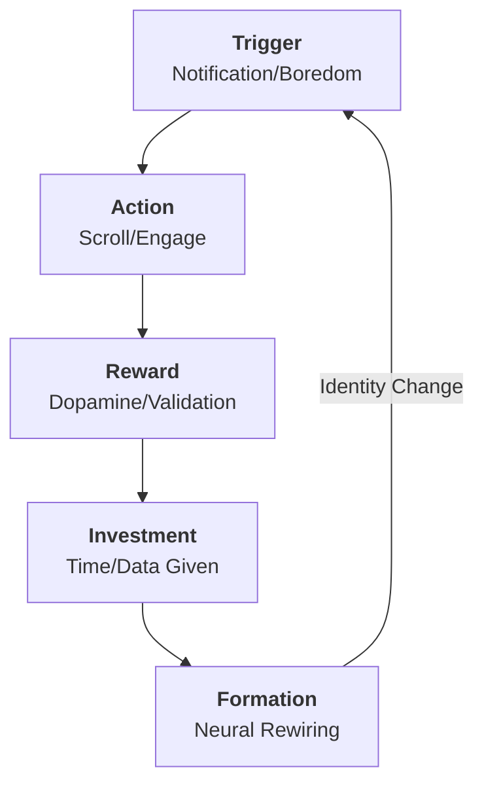

## Definition 
The silent, repetitive process by which engagement algorithms shape human identity, desires, and worldviews. It is [[Passive Discipleship]]; where the user is gradually trained to think, feel, and value specific things based on what keeps them scrolling.

Human beings are teleological creatures; we are always "becoming" something. Historically, this formation happened through church, family, and community (Spiritual Formation). Today, it happens through the feed. **Algorithmic Formation** leverages neuroplasticity: by repeatedly exposing the brain to high-arousal stimuli (outrage, fear, lust), the algorithm physically rewires neural pathways, effectively "catechizing" the user into the values of the platform (speed, vanity, tribalism).

## Diagram 

## Signs / markers
- **The "Hive Mind" Shift:** You find yourself using specific internet slang or adopting political takes you didn't hold 2 weeks ago, simply because "everyone" on your feed is doing it.
- **Erosion of Empathy:** You begin viewing people outside your "tribe" as caricatures or enemies because the algorithm rewards conflict over nuance.
- **Attention Atrophy:** The inability to sit in silence or read a book for 20 minutes without reaching for the phone (the brain has been trained for high-speed switching).

## Examples 
- **[[Radicalization Pipelines]]:** How a user watching fitness videos is slowly nudged toward "Manosphere" or extreme political content because the algorithm prioritizes "watch time" via outrage.
- **Beauty Standards:** A generation of women subconsciously believing they need lip fillers because the algorithm disproportionately promotes faces with those features (the "Instagram Face").
- **Audience Capture:** Creators who start acting more extreme or performative because that is what their algorithmically-curated audience rewards.

## Contrasts
- **Opposite:** [[Spiritual Formation]] (The intentional, slow process of becoming like Christ through discipline and grace).
- **Related-but-not-the-same:** Brainwashing (Brainwashing is usually coercive/forceful; Algorithmic Formation is seductive/voluntary).

## Related terms
- [[Digital Gnosticism]]
- [[Trustworthy UX]] (The solution: designing for agency, not addiction).
- [[Digital Discernment]]

## Biblical lens (NKJV)
**Scripture:** "And do not be conformed to this world, but be transformed by the renewing of your mind..." (Romans 12:2, NKJV)
**Discernment:** The Greek word for "conformed" here (*suschematizo*) implies being pressed into a mold. Algorithms are the modern "mold" of the world. They press us into shapes that benefit advertisers. The Christian mandate is to resist this passive molding and actively "renew the mind" through higher-quality inputs (Scripture).