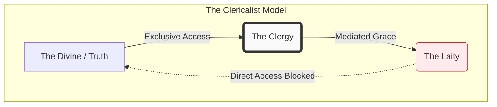

## Definition
A disordered attitude or structural arrangement within a religious institution that privileges the clergy (priests, pastors, bishops) as a superior class, separate from and ruling over the laity. It is the belief, explicit or implicit, that the clergy *constitute* the church, while the laity are merely the customers, subjects, or audience to be managed.

**Clericalism** is often described as the "Bureaucratization of Grace." It occurs when the **Office** (the role) subsumes the **Person** and the **Community**, creating a strict caste system within the body of believers.

## Image
![[VaticanIIbishops.jpg]]

## Diagram

_(Note: The diagram illustrates the "Bottleneck" of clericalism, where the clergy positions itself as the sole mediator between the Divine and the Laity, blocking direct access)._

## Archetypal Figures & Case Studies

> [!abstract] The Grand Inquisitor (Dostoevsky) **The Trait:** _The Burden Bearer._ 
> **The Analysis:** In _The Brothers Karamazov_, the Inquisitor argues that ordinary people are too weak to handle the freedom Jesus offers. Therefore, the Church must rule over them with "miracle, mystery, and authority." He represents the ultimate clericalist belief: that the clergy must control the masses "for their own good." **Lesson:** Clericalism often disguises a lust for power as benevolent protection.

> [!abstract] The Celebrity Pastor (The Brand) **The Trait:** _The Persona as Institution._ 
> **The Analysis:** In modern Protestant contexts, clericalism manifests as the "Celebrity Pastor." The leader becomes the brand; their charisma is the church's only asset. Accountability boards are often stacked with friends or employees who cannot challenge the leader without destroying the "business." **Lesson:** When the messenger becomes more important than the message, the system is clericalist.

> [!abstract] The Gatekeeper (The Bureaucrat) **The Trait:** _Administrative Control._ 
> **The Analysis:** The figure who treats sacraments, budgets, or information as private property. They withhold transparency not for security, but to maintain the power differential. "Father knows best" extends beyond theology into finance and law. **Lesson:** Secrecy is the petri dish of clericalism.

## The Narrative Arc (The Cycle of Separation)

1. **The Elevation (Ordination/Calling):** The individual is set apart. Instead of being viewed as a functional change (different role), it is viewed as an ontological superiority (better soul).
    
2. **The Isolation (The Pedestal):** The leader is removed from the normal feedback loops of community life. They are surrounded by "yes-men" or admirers, losing touch with the reality of the average congregant.
    
3. **The Impunity (The Shield):** Because they are "special," normal rules do not apply. Small moral failings are overlooked as "the cost of greatness."
    
4. **The Collapse (The Scandal):** The protected behavior eventually festers into abuse or major failure. The institution attempts to cover it up to "protect the ministry," confirming the clericalist priority.
    

## Signs / markers

- **Secrecy / Impunity:** Major decisions regarding finance, direction, or discipline are made behind closed doors by the "ordained," with zero accountability to the people who fund and populate the church.
    
- **"Father Knows Best":** The assumption that religious authority confers expertise in unrelated fields—such as finance, management, politics, or psychology.
    
- **The Passive Laity:** A congregation that behaves like an audience at a theater performance—watching the professionals "do church" rather than participating in the liturgy or mission.
    

## Examples

- **The Abuse Crisis:** The ultimate historical fruit of clericalism. The hierarchy protected the _reputation of the clergy_ rather than the _bodies of the victims_. The "caste" closed ranks to protect its own against the "commoners."
    
- **"Touching the Anointed":** A rhetorical device used in some charismatic circles to shut down legitimate questions about leadership ethics or spending.
    
- **Secular Clericalism (The Expert Class):** In secular society, this dynamic appears when "The Experts" or "The Science" are invoked to shut down debate. The "new clergy" (technocrats/scientists) claim exclusive access to truth, and the public (laity) is expected to comply without question.
    

## Contrasts

- **Opposite:** **Servant Leadership:** A model where the leader bleeds for the flock rather than feeding on it; authority is used to empower, not subjugate.
    
- **Opposite:** **Co-responsibility:** The concept (emphasized in Vatican II) that laity and clergy share distinct but equal responsibility for the church's mission.
    
- **Related-but-not-the-same:** **Hierarchy:** Hierarchy is a structure of _order_ (necessary for function). Clericalism is a structure of _value_ (toxic to community).
    

## Related terms

- **[[Hagiography]]** — Clericalism relies on hagiography (idealized biography) to maintain the illusion of the leader's perfection.
    
- **[[Moral Injury]]** — When a cleric abuses their power, it causes deep moral injury to the victim because the abuser represents God.
    
- **[[Institutional Self-Preservation]]** — The prime directive of a clericalist system.
    
- **[[Sacerdotalism]]** — The belief that priests are essential, indispensable mediators between God and man.
    

## Biblical lens (NKJV)

**Scripture:**

- _"But you are not to be called ‘Rabbi,’ for you have one Teacher, the Christ, and you are all brethren."_ — **Matthew 23:8**
    
- _"Nor as being lords over those entrusted to you, but being examples to the flock."_ — **1 Peter 5:3**
    

**Discernment:** Jesus was arguably the most anti-clerical figure in religious history. He reserved his harshest condemnation not for "sinners" (tax collectors, prostitutes), but for the religious elite (Pharisees/Sadducees) who "shut up the kingdom of heaven against men" (Matt 23:13). The tearing of the Temple Veil at the crucifixion symbolizes the destruction of the architectural separation between God and the people.

## Sources / lineage

- **Primary Literary Critique:** _[The Grand Inquisitor (Fyodor Dostoevsky)](https://www2.hawaii.edu/~freeman/courses/phil100/11.%20Dostoevsky.pdf)_ — _A profound critique of the church exchanging spiritual freedom for temporal power._
    
- **Sociological Analysis:** _[Clericalism: The Death of Priesthood (George B. Wilson)](https://pastoralcenter.sfo3.digitaloceanspaces.com/products/lp/lp2945/preview.pdf)_ — _Analyzes the systemic roots of the problem within the structure of the priesthood._
    
- **Historical Context:** _[True and False Reform in the Church (Yves Congar)](https://dokumen.pub/download/true-and-false-reform-in-the-church.html)_ — _Congar argued for a return to the sources to break the encrustation of clerical power._
    

## Notes

- **The Paradox of Leadership:** Healthy systems recognize a paradox: sheep need shepherds to guide them, but sheep do not need intermediaries to eat grass. The healthy leader points _away_ from themselves toward the Source (Truth), whereas the clericalist leader positions themselves _as_ the Source.