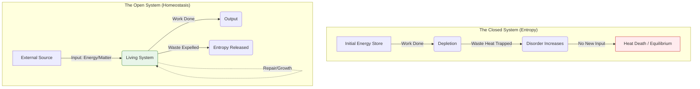

## Definition 
In physics, a physical system that does not exchange any matter with its surroundings (and in a *truly* isolated system, no energy either), meaning it is destined to degrade into disorder (entropy) over time. Theologically, it describes a worldview or lifestyle that cuts itself off from transcendent sources (Grace/God), relying entirely on internal resources (Willpower/Ego) to survive.

**The Closed System** is the mathematical definition of **Hopelessness**.
* **The Physics of Death:** According to the Second Law of Thermodynamics, any closed system will eventually reach "Heat Death" (maximum entropy). It cannot increase its order or energy because it has no input. It can only rearrange the furniture while the house burns down.
* **The Secular Trap:** Philosopher Charles Taylor calls this the **"Immanent Frame"**; a world where we have "locked the windows" to the supernatural. We are protected from demons, but we are also cut off from angels. We are safe, but we are suffocating.
* **The Burnout Engine:** If a human soul operates as a Closed System ("I must do this all myself"), they are burning their own mass for fuel. This works for a while (high performance), but inevitably leads to total collapse because the output exceeds the input.

## Diagram

## Archetypal Figures & Case Studies

> [!abstract] Sisyphus (Greek Myth)
> **The Trait:** *The Eternal Grind.*
> **The Analysis:** Sisyphus is the patron saint of the Closed System. He pushes the boulder up the hill, and it rolls down. He cannot ask Zeus for help; he cannot build a machine; he cannot leave the hill. He is locked in a loop of energy expenditure with zero progress.
> **Lesson:** Hard work in a closed system is futile.

> [!abstract] The Rich Fool (Luke 12)
> **The Trait:** *The Silo.*
> **The Analysis:** The man builds bigger barns to store *his* grain for *his* soul. He talks only to himself ("I will say to my soul..."). He creates a perfect, airtight system of wealth. That night, his soul is required of him. He dies because a Closed System cannot survive the intrusion of Reality (God).
> **Lesson:** Accumulation is not life; connection is life.

> [!abstract] The "Self-Made Man"
> **The Trait:** *The Myth of Autonomy.*
> **The Analysis:** A cultural idol who claims to need no one. He refuses help, refuses grace, and refuses vulnerability. He appears strong but is structurally fragile because he has no redundancy. One failure crashes the whole system.

## The Narrative Arc (The Heat Death)

### 1. The Seal (The Lockdown)
The individual decides (usually out of trauma or pride) to rely only on themselves. "I don't need anyone." They seal the borders of the soul.

### 2. The Peak (The High)
Initially, the system performs well. The pressure inside rises. Productivity is high. This is the **"Manic Phase"** of self-reliance.

### 3. The Decay (The Entropy)
Disorder begins to increase. Mistakes happen. Energy levels drop. Because the system is closed, the person cannot "import" help (prayer, therapy, community). They simply work harder.

### 4. The Collapse (The Equilibrium)
The internal battery hits 0%. The system reaches equilibrium with the dust. This is **Burnout** or **Despair**.

## Signs / markers
-   **Scarcity Mindset:** The belief that "there isn't enough" (time, love, money). In a Closed System, this is true (resources are finite). In an Open System, it is false.
-   **Defensiveness:** A Closed System must protect its boundaries at all costs. Criticism is seen as an invasion.
-   **Exhaustion:** Not the "good tired" of a workout, but the "deep tired" of a battery that won't hold a charge.

## Examples (culture / tech / daily life)
-   **"Hustle Culture":** The belief that you can out-work your need for rest. It treats the human body as a machine that can run indefinitely without maintenance (grace).
-   **Echo Chambers:** A "Closed System" of information. You only hear what you already believe. Intellectual entropy sets in, and the mind becomes radicalized and stupid.
-   **The "Immanent Frame" (Secularism):** A society that organizes itself as if God does not exist. It creates high anxiety because *we* have to be the gods, and we aren't qualified for the job.

## Contrasts
-   **Opposite:** **Open System:** A system that freely exchanges energy and matter with its environment (e.g., a living cell, a praying soul). It can grow and repair itself.
-   **Opposite:** **Divine Synergy:** The act of opening the valve to let the external power in.
-   **Related-but-not-the-same:** **Isolation:** Isolation is a social state; A Closed System is an *ontological* state. You can be at a party and still be a Closed System.

## Related terms
-   **[[Entropy]]** — The inevitable fate of all Closed Systems.
-   **[[Pelagianism]]** — The theological heresy of the Closed System (saving yourself).
-   **[[Divine Energy]]** — The external fuel source that breaks the Closed System.
-   **[[Zero-Sum Game]]** — The economic logic of a Closed System.

## Biblical lens (NKJV)
**Scripture:**
* *"Unless the Lord builds the house, They labor in vain who build it."* — **Psalm 127:1**
    * *Translation:* You can build a house in a Closed System, but it is "vain" (empty/futile). The energy input (labor) does not yield the outcome (home) without the external Variable (The Lord).
* *"I am the vine, you are the branches... without Me you can do nothing."* — **John 15:5**
    * *Translation:* A branch cut off from the vine becomes a Closed System. It has sap for a few hours, then it withers.

## Sources / lineage
-   **Scientific Source:** *[The Second Law of Thermodynamics](https://www.sfu.ca/~mbahrami/ENSC%20388/Notes/Second%20Law%20of%20Thermodynamics.pdf)* — *The physics proving that isolation leads to disorder.*
-   **Philosophical Source:** *[A Secular Age (Charles Taylor)](http://flte.fr/wp-content/uploads/2017/11/Taylor-A-secular-Age-summary.pdf)* — *The concept of the "Immanent Frame" (living inside a closed box).*
-   **Theological Source:** *[The Weight of Glory (C.S. Lewis)](https://www.doxaweb.com/assets/weight_of_glory.pdf)* — *Argues that we are locked in a prison of our own making until we let the "Fresh Air" (God) in.*

## Notes
-   **Brand Relevance:** This is the diagnosis for your client's pain. "You feel like you are dying because you are a Closed System trying to do an Open System's job." The solution isn't "better time management" (rearranging the closed system); it is **Prayer** (opening the system).
-   **The "Control" Fallacy:** We keep the system closed because we want Control. To open the system (Grace) is to lose Control. This is a canonical struggle.