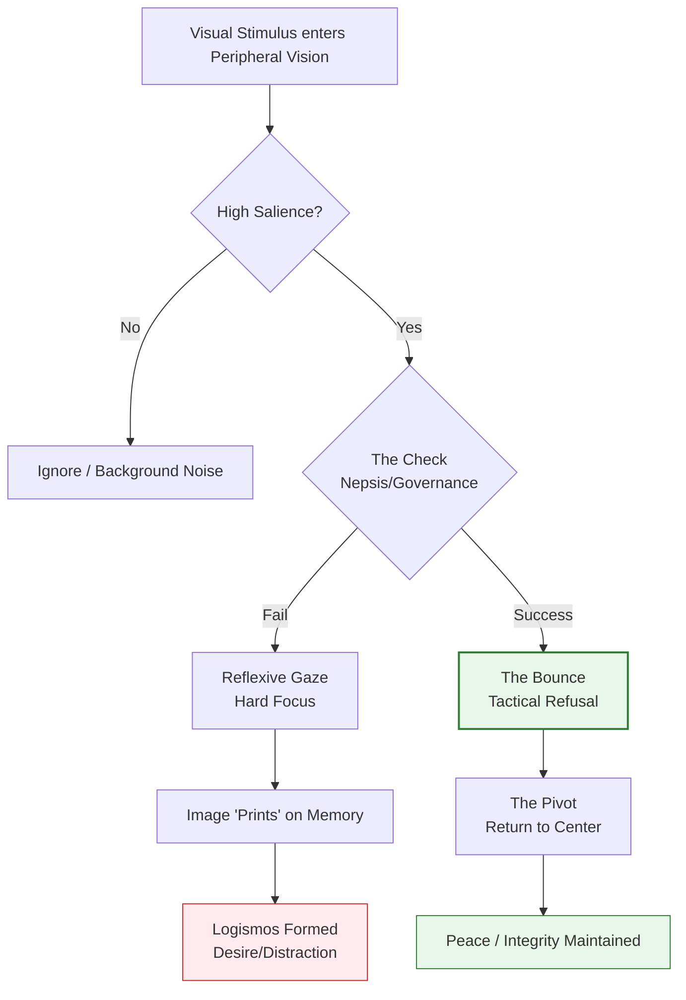

## Definition  
A spiritual discipline involving the deliberate restriction of one's gaze to avoid taking in sensory data that provokes lust, envy, or distraction. It is the tactical refusal to look at things that do not concern one's vocation or soul, acting as a firewall against visual *Logismoi*.

**Custody of the Eyes** is "Input Management" for the brain. In an **Attention Economy** designed to hijack the visual cortex with hyper-stimuli (ads, attractive bodies, outrage bait), this discipline is an act of **sovereignty**.

* **The Mechanism:** The eyes are the primary "bandwidth" of the soul. Visual data enters the brain faster and bypasses more logical filters than text or audio. Once an image enters, it "prints" on the memory. Custody of the Eyes prevents the "print" from happening.
* **The Logic:** It is easier to *not see* something than it is to *un-see* it. Once the image is inside, you have to fight the *logismos* (the thought). If you divert the eyes, you win the battle before it starts.
* **The Modern Application:** It isn't just about avoiding "sinful" images; it is about avoiding *useless* ones. It means not looking at the notification that pops up, not reading the comments section, not scrolling the feed. It is conserving mental energy for deep work.

## Diagram

_(Note: The diagram illustrates the decision tree of "The Bounce," contrasting the reflexive gaze with the governed gaze.)_

## Archetypal Figures & Case Studies

> [!abstract] Job (Biblical) **The Trait:** _The Covenant._ 
> **The Analysis:** "I have made a covenant with my eyes; Why then should I look upon a young woman?" (Job 31:1). Job understands that the gaze is a contract. If he looks, he has signed a deal with his lower nature. He breaks the deal by not looking. **Lesson:** The battle against lust is won at the eyelid, not the groin.

> [!abstract] The Horse with Blinders **The Trait:** _Focused Teleology._ 
> **The Analysis:** A racehorse wears blinders not because the scenery is "evil," but because it is "irrelevant." The horse has a finish line. Anything in the peripheral vision is drag. Custody of the Eyes is putting on blinders to run one's own race. **Lesson:** Peripheral vision is the enemy of forward momentum.

> [!abstract] Eve (Genesis 3) **The Trait:** _The Intake of Desire._ 
> **The Analysis:** Before she ate the fruit, she "saw that the tree was good for food... and pleasant to the eyes." The _looking_ was the first ingestion. Had she maintained Custody of the Eyes (focusing on the Tree of Life instead), the desire would not have formed. **Lesson:** Desire is shaped by attention. You want what you watch.

## The Narrative Arc (The Gaze)

1. **The Stimulus (The Flash):** An object enters the peripheral vision (a billboard, a person, a notification). The brain flags it as "High Salience" (important/rewarding).
    
2. **The Check (The Governance):** The _Nepsis_ (Watchman) intervenes. Instead of reflexively turning the head to center the object, the will overrides the reflex. This is the **"Bounce"**—the eyes hit the object and bounce off immediately.
    
3. **The Pivot (The Re-centering):** The gaze is forcibly returned to the "Center"—the work, the face of the person being spoken to, or the icon.
    
4. **The Peace (The Reward):** Because the image was not "centered," the brain does not release the dopamine/cortisol spike. The interior atmosphere remains calm. The _Logismos_ dies of starvation.
    

## Signs / markers

- **Looking Down/Away:** The instinct to avert gaze in high-risk environments (e.g., a beach, a mall, a chaotic internet sidebar).
    
- **"Notification Blindness":** The trained ability to ignore red dots on a screen.
    
- **Deep Focus:** The ability to maintain eye contact with a human being because the mind isn't scanning the room for better options.
    

## Examples (culture / tech / daily life)

- **Digital Ad Blockers:** Automated "Custody of the Eyes" for a browser. It removes the visual clutter so the user can read the text.
    
- **The "Grey Scale" Phone:** Turning a phone screen black and white reduces the visual salience of apps (making them less tasty to the eye), effectively helping the user maintain custody.
    
- **Driving:** A driver does not look at the accident on the side of the road ("rubbernecking") because looking causes the hands to steer toward the ditch. One looks where one wants the car to go.
    

## Contrasts

- **Opposite:** **Voyeurism:** Seeking out visual stimulation; the hungry eye.
    
- **Opposite:** **Curiosity (Disordered):** The "need to know" or "need to see" everything (FOMO).
    
- **Related-but-not-the-same:** **Modesty:** Modesty is about _being_ seen; Custody is about _seeing_.
    

## Related terms

- **[[The "2-Second Rule"]]** — Custody of the Eyes is the primary tactic for succeeding at the 2-Second Rule.
    
- **Sensory Gating** — The neurological ability to filter out redundant or irrelevant stimuli.
    
- **Idolatry** — Often begins with the eyes ("Eidolomania").
    
- **Prudence** — The virtue of seeing reality correctly; Custody ensures you see reality, not fantasy.
    

## Biblical lens (NKJV)

**Scripture:**

- _"The lamp of the body is the eye. If therefore your eye is good, your whole body will be full of light."_ — **Matthew 6:22**
    
- _"Turn away my eyes from looking at worthless things, And revive me in Your way."_ — **Psalm 119:37**
    

**Discernment:** The eye is the aperture of the soul. If the lens is dirty (lustful/greedy), the interior room is dark. The Psalmist prays for God to control his neck muscles, recognizing that "worthless things" (Vanity) drain the life out of the soul.

## Sources / lineage

- **Patristic Source:** _[The Ladder of Divine Ascent (St. John Climacus)](http://www.prudencetrue.com/images/TheLadderofDivineAscent.pdf)_ — _Discusses how the eyes are the "thieves" of the heart._
    
- **Modern Tech Criticism:** _[The Age of Surveillance Capitalism (Shoshana Zuboff)](https://raggeduniversity.co.uk/wp-content/uploads/2024/08/1_x_Shoshana-Zuboff-The-Age-of-Surveillance-Capitalism_-The-Fight-for-a-Human-Future-at-the-New-Frontier-of-Power-PublicAffairs-Books-2019.pdf)_ — _Explains how "eye tracking" is the mechanism of modern control._
    
- **Fiction:** _[A Portrait of the Artist as a Young Man (James Joyce)](https://almabooks.com/wp-content/uploads/2016/10/A-Portrait-of-the-Artist-Excerpt.pdf)_ — _Stephen Dedalus practices "custody of the eyes" (walking with eyes downcast) during his brief period of extreme piety._
