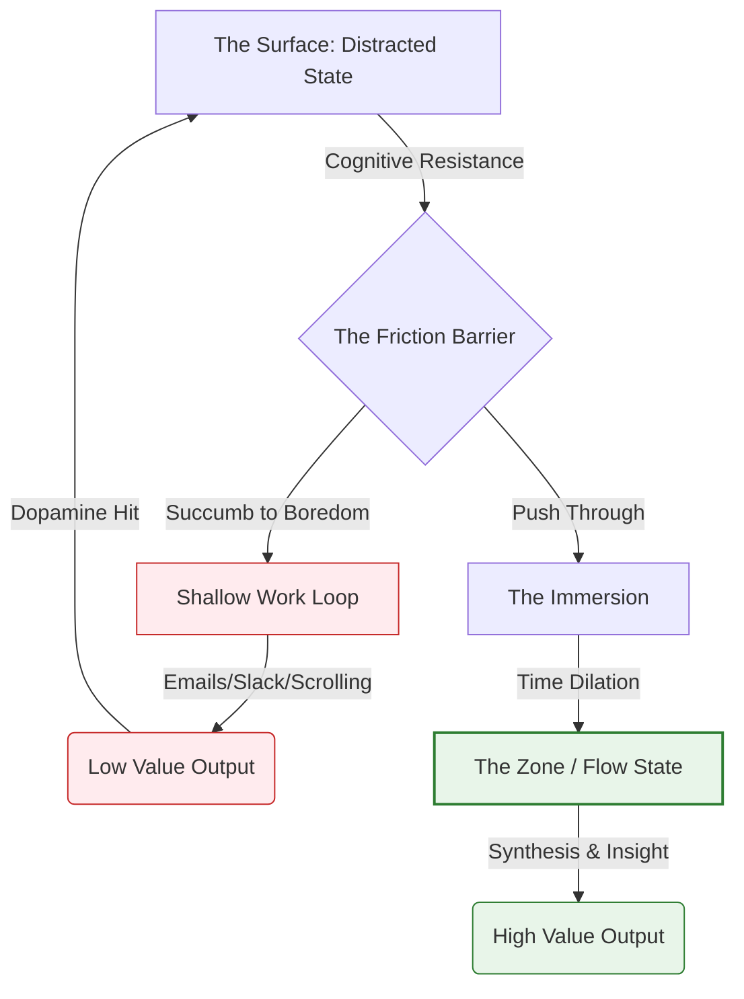

## Definition 
A term coined by Cal Newport referring to professional activities performed in a state of distraction-free concentration that push cognitive capabilities to their limit. Theologically, it is the consecration of the intellect to a single task, viewing attention as a limited resource that must be stewarded rather than squandered.

**Deep Work** is the secular equivalent of **Contemplation**. In an economy that trades on attention, the ability to focus without distraction is the new "Superpower."
* **The Cognitive Moat:** As AI and automation take over "Shallow Work" (emails, logistics, data entry), the only value left for humans is high-level synthesis, complex problem solving, and creative insight. These require Deep Work.
* **The Resistance:** Deep Work is physically painful for the modern brain because the brain is addicted to the dopamine of "novelty" (notifications). Deep Work is a **Detox**. It requires "boredom tolerance."
* **The Liturgy of Labor:** It elevates work from "busyness" to "craft." It assumes that what you are doing is important enough to deserve your full self. To give partial attention is an insult to the work and to the God who gave the work.

## Diagram

## Archetypal Figures & Case Studies

> [!abstract] Carl Jung (The Tower)
> **The Trait:** *The Physical Cloister.*
> **The Analysis:** To birth Analytical Psychology, Jung built a stone tower in Bollingen without electricity. He locked himself in for weeks to think thoughts that could not be thought in the noise of Zurich. He understood that **Depth requires Isolation**.
> **Lesson:** If you want to change the world, you must leave the world occasionally.

> [!abstract] The Medieval Scribe
> **The Trait:** *Illuminated Focus.*
> **The Analysis:** A monk spending six months illuminating the letter "G" in a Gospel manuscript. He is not rushing; he is worshipping. The "Deep Work" is an act of prayer. The beauty of the output is directly correlated to the depth of the focus.
> **Lesson:** Speed is the enemy of sanctity.

> [!abstract] J.K. Rowling (The Hotel)
> **The Trait:** *The Expensive Silence.*
> **The Analysis:** When finishing the last Harry Potter book, she couldn't focus at home (dogs, kids). She checked into the Balmoral Hotel in Edinburgh for months. She paid thousands of dollars just for *silence*. She knew the ROI of Deep Work exceeded the cost of the room.

## The Narrative Arc (The Dive)

### 1. The Resistance (The Surface)
You sit down. The brain screams for stimulation. You want to check email, clean the desk, or get a snack. This is the **"Friction of Entry."**

### 2. The Immersion (The Descent)
You refuse the distraction (see **[[The "2-Second Rule"]]**). You push through the boredom. After about 15–20 minutes, the brain accepts the task.

### 3. The Flow (The Zone)
Time dilates. You lose self-consciousness. The work becomes fluid. You are connecting ideas that were previously disparate. This is **High Agency** cognition.

### 4. The Resurfacing (The Fatigue)
You emerge after 90–120 minutes. You are exhausted but satisfied. You have produced something of value. (Note: You can only do about 4 hours of this a day).

## Signs / markers
-   **Inaccessibility:** You are hard to reach. Your phone is in another room.
-   **Ritualization:** You have a specific cup, a specific playlist, or a specific time. The ritual triggers the brain state.
-   **Output over Activity:** You judge the day not by "how many emails I sent" but by "how much *new value* I created."

## Examples (culture / tech / daily life)
-   **"Monk Mode":** A trend among tech founders to disappear for 2 weeks to code the MVP.
-   **The Writers' Room:** A protected space where no phones are allowed, and the only goal is to crack the story.
-   **Shabbat:** A temporal form of Deep Work (or Deep Rest) where the distraction of commerce is legally forbidden so the soul can focus on God.

## Contrasts
-   **Opposite:** **Shallow Work:** Logistical-style tasks, performed while distracted (e.g., answering Slack while on a Zoom call). It creates no new value and is easy to replicate.
-   **Opposite:** **Multitasking:** A myth. The brain cannot multitask; it "task switches," which lowers IQ by 10 points.
-   **Related-but-not-the-same:** **Hyperfocus:** Often associated with ADHD; hyperfocus is uncontrolled. Deep Work is *controlled*, intentional focus.

## Related terms
-   **[[The Cloister]]** — The architecture required for Deep Work.
-   **[[Attention Economy]]** — The enemy of Deep Work.
-   **[[Sublimation]]** — Channeling the energy of distraction into the work.
-   **[[Vibrant Interior Life]]** — Deep Work feeds the interior life.

## Biblical lens (NKJV)
**Scripture:**
* *"And that you also aspire to lead a quiet life, to mind your own business, and to work with your own hands..."* — **1 Thessalonians 4:11**
    * *Translation:* Paul elevates "Quiet" and "Focus" as Christian virtues.
* *"Redeeming the time, because the days are evil."* — **Ephesians 5:16**
    * *Translation:* Time is being stolen (by evil/distraction). You must "buy it back" (redeem it) through intentionality.

## Sources / lineage
-   **Primary Source:** *[Deep Work (Cal Newport)](https://reclaro.com/vistage-resources/deep-work.pdf)* — *The manifesto for this movement.*
-   **Classic Psychology:** *[Flow: The Psychology of Optimal Experience (Mihaly Csikszentmihalyi)](https://files.blogs.baruch.cuny.edu/wp-content/blogs.dir/2418/files/2013/04/Mihaly-Csikszentmihalyi-Flow.pdf)* — *The science of being "in the zone."*
-   **Theological Parallel:** *[The Practice of the Presence of God (Brother Lawrence)](https://www.basilica.ca/documents/2016/10/Brother%20Lawrence-The%20Practice%20of%20the%20Presence%20of%20God.pdf)* — *Deep Work applied to washing dishes.*