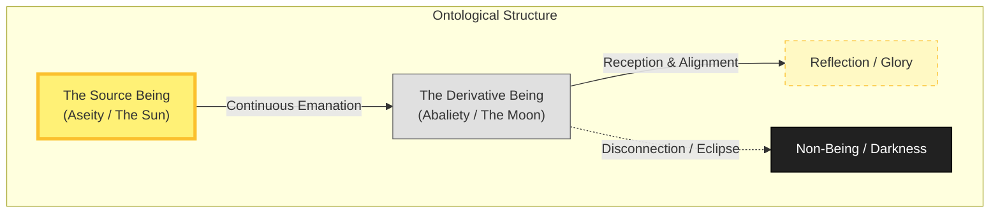

## Definition
The ontological reality that human beings do not possess existence, life, or identity in themselves (*Aseity*), but receive these attributes continuously from an external Source. To be a derivative being is to be "from another" (*ab alio*); in classical metaphysics, it distinguishes the creature (which must be sustained) from the Creator (who sustains Himself).

**Derivative Being** (or *Abaliety*) is the philosophical counterweight to the concept of Autonomy. It asserts that human existence is not a static property that one "owns," but a continuous event of reception.

* **The Theological Distinction:** In classical theology, only God possesses **Aseity** (existence *a se*, or "from himself"). He is the "I AM." He requires no external fuel. Humans possess **Abaliety** (existence *from another*). They are contingent. If the Source were to cease sustaining the derivative being, the derivative being would not merely die; it would vanish into non-existence.
* **The Modern Conflict:** Modern individualism often encourages the psychology of Aseity—the belief that one must generate their own truth, energy, and identity ex nihilo. This forces a *Derivative Being* to attempt to function as a *Source Being*, a structural impossibility that often leads to psychological and spiritual collapse (Burnout).
* **The Function:** The proper function of a derivative being is *reflection* rather than *generation*. Just as the moon does not generate light but reflects the sun, the derivative being does not generate "glory" or "being" but reflects the Source.

## Note

- **The Ethical Shift:** Embracing derivative being shifts the ethical imperative from "Production" (I must make meaning) to "Reception" (I must receive meaning). This is often the cure for the modern anxiety of self-creation.

## Images

![[9285542.png]]

## Diagram

_(Note: The diagram illustrates that a Derivative Being has two potential states: Reflection (when aligned with the Source) or Darkness (when disconnected), but it never generates its own light)._

## Examples (culture / tech / daily life)

- **The Mirror:** A mirror does not "strive" to reflect. It simply _faces_ the object. Its work is "Facing," not "Creating."
    
- **The Smart Phone:** A smartphone is powerful, but it is ontologically derivative. It depends entirely on the Battery and the Signal. Without these external inputs, it is effectively a brick.
    
- **The "Streamer":** In the digital economy, a streamer is dependent on the platform (Twitch/YouTube). If the platform ceases to host them, their digital existence ends. This mimics the relationship between the creature and the Creator.

## Archetypal Figures & Case Studies

> [!abstract] The Moon (Cosmic Symbol) **The Trait:** _The Great Reflector._ 
> **The Analysis:** The Moon possesses no internal luminescence; it is geologically a dark rock. Its "light" is entirely a function of its **Orientation** relative to the Sun. If the Moon were to attempt to generate its own light, it would fail. Its glory is derivative. **Lesson:** Position is more important than production.

> [!abstract] Adam (Genesis 2) **The Trait:** _Dust + Breath._ 
> **The Analysis:** In the Genesis narrative, Adam is "dust" (inert matter) until the _Ruach_ (Breath/Spirit) enters him. He is a composite being—a container for Life rather than Life itself. The moment the Breath is withdrawn, he reverts to dust. **Lesson:** A derivative being is only "alive" as long as the inhalation continues.

> [!abstract] The "Influencer" (The Failed Sun) **The Trait:** _Exhausted Autonomy._ 
> **The Analysis:** The cultural pressure to "be a star" is effectively a command to possess Aseity. The individual attempts to generate "light" (content/identity) from their own ego resources. This invariably leads to exhaustion because it violates the ontological limits of the creature.

## The Narrative Arc (The Orbit)

1. **The Rebellion (The Eclipse):** The subject attempts to become the Source. They cut ties with external authority or tradition to "find themselves." They move out of orbit, entering the "Shadow."
    
2. **The Dark Night (The Void):** Without the connection to the Source, the subject realizes they have no internal light. They experience "Ontological Poverty"—the emptiness of the self when left strictly to its own resources.
    
3. **The Return (The Alignment):** The subject accepts their status as a "Satellite" rather than a "Star." They re-align their life to orbit the Center.
    
4. **The Illumination (The Reflection):** They become bright again. However, they now recognize the light is not _theirs_—it is _borrowed_. This eliminates the anxiety of "running out," as the Source is infinite.
    

## Signs / markers

- **Gratitude:** A "Source" being feels entitled ("I made this"). A "Derivative" being feels grateful ("I received this").
    
- **Low Ego:** The realization that one is a mirror reduces arrogance; a mirror does not boast of the light it reflects.
    
- **Peaceful Dependency:** An acceptance of limitation—the need for sleep, help, and grace—without shame.
    

## Contrasts

- **Opposite:** **Aseity:** Self-existence; the property of existing _from oneself_. In theology, this is a property unique to God.
    
- **Opposite:** **Autonomy:** The illusion of "Self-Law" or complete self-governance.
    
- **Related-but-not-the-same:** **Weakness:** Being derivative is not the same as being "weak" (a laser focused by a mirror is derivative but powerful). The distinction is about the _source_ of the power, not the _force_ of it.
    

## Related terms

- **Aseity** — The opposite of Derivative Being; self-sufficient existence.
    
- **Contingency** — The philosophical term for something that "could have not existed" and relies on something else.
    
- **Idolatry** — The act of worshipping a derivative being (money, sex, self) as if it were a Source being.
    
- **[[Divine Reliance]]** — The practical lifestyle of acknowledging one's derivative nature.
    

## Biblical lens (NKJV)

**Scripture:**

- _"For in Him we live and move and have our being..."_ — **Acts 17:28**
    
- _"What do you have that you did not receive? Now if you did indeed receive it, why do you boast as if you had not received it?"_ — **1 Corinthians 4:7**
    

**Discernment:** The New Testament consistently dismantles the human ego by pointing out the derivative nature of all gifts and existence. Paul argues that boasting is irrational because the subject is a receiver, not a generator, of their own virtues and life.

## Sources / lineage

- **Primary Theological Source:** _[Summa Theologica (Thomas Aquinas)](https://www.documentacatholicaomnia.eu/03d/1225-1274,_Thomas_Aquinas,_Summa_Theologiae_%5B1%5D,_EN.pdf)_ — _Detailed arguments on God as "Pure Act" and humans as "Contingent."_
    
- **Literary Source:** _[Mere Christianity (C.S. Lewis)](https://preprostost.si/wp-content/uploads/2024/06/Mere-Christianity-C.-S.-Lewis.pdf)_ — _Lewis uses the "Mirror" analogy extensively: "We are like mirrors whose brightness, if we are bright, is wholly derived from the sun that shines upon us."_
    
- **Philosophical Source:** _[Finite and Infinite (Austin Farrer)](https://repository.lsu.edu/cgi/viewcontent.cgi?article=1357&context=honors_etd)_ — _Explores the relation between the finite will and the infinite Will._
    