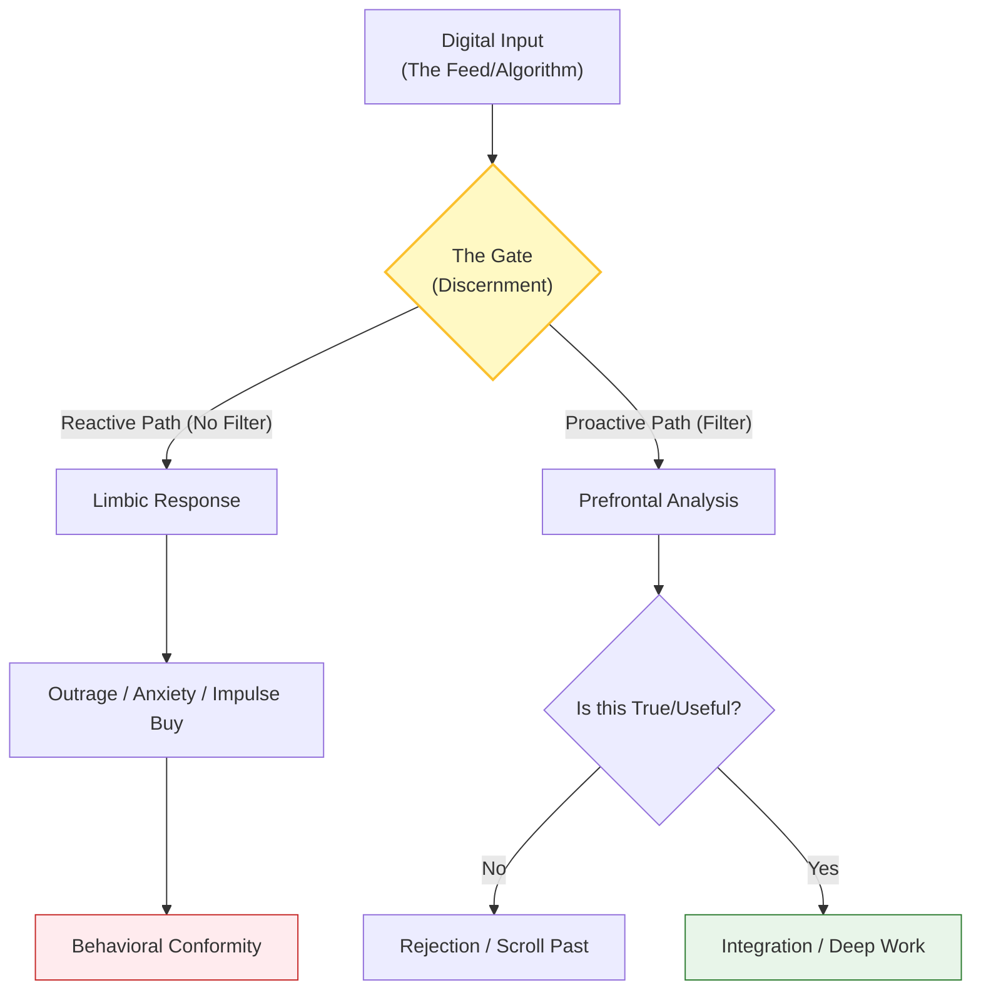

## Definition
The active, disciplined capacity to filter digital noise, verify truth claims, and resist algorithmic emotional manipulation. It is the refusal to surrender one's pace, attention, or beliefs to the dictates of a platform, involving a conscious "gating" mechanism between the digital input and the cognitive processing.

If "Syncretism" is the passive drift into absorbing the values of the digital environment, **Discernment** is the active resistance to that drift.

* **The Theological Dimension:** It involves "testing the spirits" (1 John 4:1) of the digital age; interrogating *why* a piece of content was presented, *who* benefits from the user's engagement, and *whether* the content aligns with objective truth.
* **The Neuroscientific Dimension:** It is the engagement of the **Prefrontal Cortex** (executive function and long-term planning) to override the **Limbic System** (dopamine loops and emotional reactivity). Algorithms are designed to bypass the former and stimulate the latter; discernment is the re-engagement of the higher brain.
* **The Strategic Dimension:** It treats attention as a finite resource that must be budgeted, rather than an infinite stream to be exploited.

_(Note: The diagram illustrates the diversion of digital input from the reactive "Limbic Loop" to the reflective "Executive Loop")._

## Archetypal Figures & Case Studies

> [!abstract] The Editor (The Gatekeeper) **The Trait:** _Ruthless Selection._ 
> **The Analysis:** Before the internet, editors curated what information reached the public eye based on standards of truth and relevance. In the digital age, the "Editor" is no longer a professional role but an internal faculty. The discerning user acts as their own Editor-in-Chief, rejecting 99% of the slush pile to focus on the 1% of value. **Lesson:** Without an internal editor, the mind becomes a junk drawer.

> [!abstract] The Skeptic (The Detective) **The Trait:** _Source Auditing._ 
> **The Analysis:** When presented with a viral claim or an outrage-inducing headline, the Skeptic pauses. They check the date, the author, and the original source material. They refuse to "feel" the emotion the content is designed to elicit until the facts are verified. **Lesson:** Emotion often travels faster than truth; discernment slows the process down.

> [!abstract] The Monk in the City (The Stoic) **The Trait:** _Detached Engagement._ 
> **The Analysis:** This figure lives within the digital world but is not _of_ it. They use tools (email, maps, banking) but reject toys (infinite scroll, gamified engagement). They maintain an inner silence that the noise cannot penetrate. **Lesson:** Utility does not require immersion.

## The Narrative Arc (The Filter)

1. **The Intrusion (The Notification):** A piece of content attempts to enter the user's consciousness. It uses "Supernormal Stimuli" (bright colors, urgent sounds, attractive faces) to demand attention.
    
2. **The Pause (The Gap):** Instead of immediate engagement, the discerning user creates a temporal gap. This is the "24-hour rule" for opinions or the "2-second rule" for visual stimuli.
    
3. **The Interrogation (The Test):** The user asks: "Is this relevant to my vocation? Is this true? Is this designed to make me angry?"
    
4. **The Decision (The Agency):** Based on the interrogation, the user either engages deeply (if valuable) or dismisses entirely (if noise). The algorithm's loop is broken.
    

## Signs / markers

- **The "Pause" Protocol:** A deliberate habit of waiting (often 24 hours) before forming an opinion or sharing a "trending" topic.
    
- **Source Auditing:** The reflex to check the origin of a claim before allowing it to affect one's emotional state.
    
- **Curated Friction:** The intentional addition of obstacles to app access (e.g., removing FaceID, hiding icons in folders, using complex passwords) to prevent mindless, muscle-memory scrolling.
    

## Examples (culture / tech / daily life)

- **"Dumb" Phone Mode:** Configuring a smartphone to act as a tool rather than an entertainment center (e.g., enabling grayscale, disabling all non-human notifications).
    
- **The "Long-Form" Shift:** Choosing to consume one high-density source (a book, a long essay) rather than fifty low-density sources (tweets, TikToks) to understand a complex topic.
    
- **RSS over Algorithms:** Using RSS readers or direct subscriptions to choose exactly what to read, rather than letting an algorithmic "For You" page dictate the information diet.
    

## Contrasts

- **Opposite:** **[[Digital Syncretism]]** (The passive acceptance of the feed as truth; allowing the algorithm to shape one's worldview without resistance).
    
- **Opposite:** **[[Reactionary Media]]:** Content designed specifically to bypass discernment and trigger immediate physiological arousal (anger/fear).
    
- **Related-but-not-the-same:** **Digital Detox** (Detox is a temporary removal from the system to reset; Discernment is the permanent skill of living wisely _within_ the system).
    

## Related terms

- **[[Algorithmic Formation]]** — The process by which algorithms shape human character; discernment is the defense against this.
    
- **[[Attention Economy]]** — The economic system that necessitates discernment.
    
- **[[Trustworthy UX]]** — User experience design that encourages discernment rather than impulse.
    

## Biblical lens (NKJV)

**Scripture:**

- _"And do not be conformed to this world, but be transformed by the renewing of your mind, that you may prove what is that good and acceptable and perfect will of God."_ — **Romans 12:2**
    
- _"Test all things; hold fast what is good."_ — **1 Thessalonians 5:21**
    

**Discernment:** The "world" (or _aion_, age) is structured by systems—today, algorithmic ones; designed to conform the human mind to patterns of consumption, anxiety, and comparison. "Renewing the mind" requires actively breaking that pattern to determine what is actually good (God's will) versus what is merely "engaging" (The Algorithm's will).

## Sources / lineage

- **Primary Source:** _[Digital Minimalism (Cal Newport)](https://ia601802.us.archive.org/22/items/digital-minimalism-by-cal-newport/Digital%20Minimalism%20by%20Cal%20Newport%20.pdf)_ — _Provides the structural framework for high-agency technology use._
    
- **Theological Foundation:** _[14 Rules for Discernment (St. Ignatius of Loyola)](https://uploads.weconnect.com/mce/17e89c359872f5659b5d7892ba8e52821c93eef3/Revive/Simplified%20Rules%20of%20Ignatius.pdf)_ — _Ancient protocols for distinguishing between "good spirits" (peace/truth) and "bad spirits" (anxiety/deception)._
    
- **Cultural Criticism:** _[Amusing Ourselves to Death (Neil Postman)](https://ia801705.us.archive.org/4/items/Various_PDFs/NeilPostman-AmusingOurselvesToDeath.pdf)_ — _Predicted the loss of discernment in an image-based culture._
    

## Notes

- **The Willpower Fallacy:** Discernment is often mistaken for "willpower." However, in a high-tech environment, willpower is a finite resource that depletes quickly. True discernment relies on **Protocols** (rules and systems) rather than raw effort.
