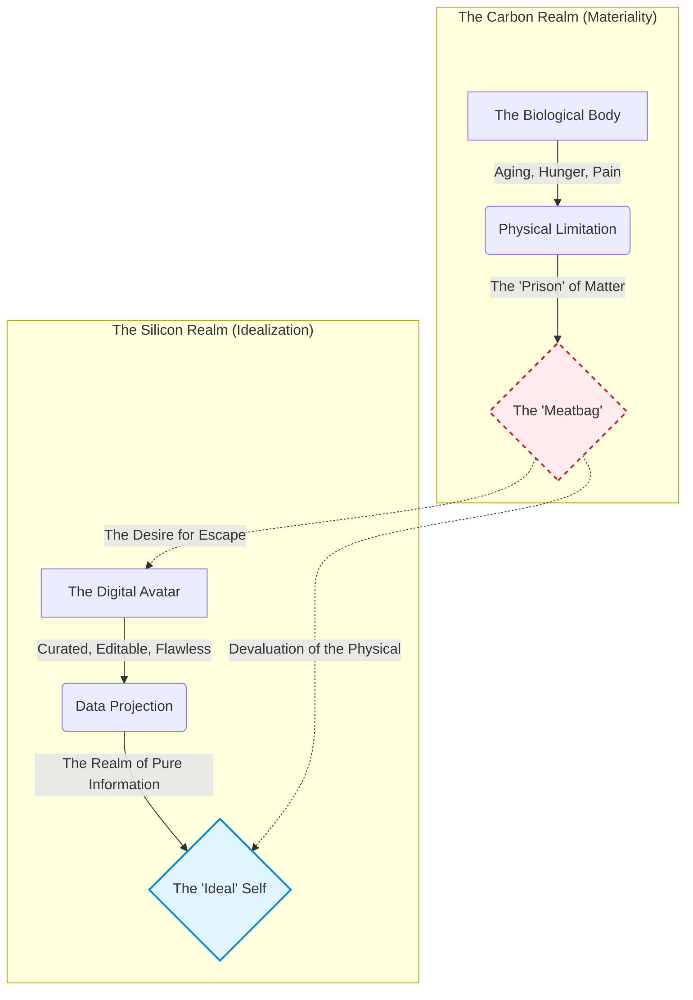

## Definition
A philosophical and theological framework, largely implicit in modern technology usage, positing that the essential self is located in the mind, consciousness, or data, while the physical body is viewed as a limitation, a temporary vessel, or an obstacle to be overcome. It is the belief that information is distinct from, and superior to, the material substrate that carries it.

## Image

![[gnosticism.jpg]]

The term draws a direct lineage to ancient Gnosticism (from Greek *gnōsis*, meaning knowledge), a diverse religious movement in the early common era that taught the material world was inherently corrupt or evil, and that salvation was achieved through secret spiritual knowledge enabling the soul to escape the prison of the body.

**Digital Gnosticism** updates this dualism for the information age:

* **The New Gnosis:** Instead of mystical spiritual knowledge, the liberating force is now *data* and *computation*.
* **The New Prison:** The biological body; with its aging, fatigue, and limitations—is viewed as the "meatbag" or obsolete hardware hindering the "software" of the mind.
* **The Aspiration:** The implicit goal of high-tech existence becomes the transcendence of physical limitations through digital avatars, curated online personas, and eventually, hypothetical concepts like mind-uploading. It fosters a worldview where the edited, digital representation of a person is considered more "real" or desirable than their physical actuality.

## Illustration

_(Note: The illustration visualizes the Gnostic split, showing the movement away from the perceived limitations of biology toward the idealized projection of data)._

## Signs / markers

- **Sensory Dissociation (Bio-Apathy):** A pattern of ignoring basic biological signals (thirst, posture strain, need for sleep) because the cognitive engagement with the screen is prioritized over physical well-being.
    
- **Frictionless Communication Preference:** A strong preference for text-based or asynchronous communication over phone or in-person interactions, as the former allows for editing of the personality and concealment of the physical state (e.g., nervous ticks, tired appearance).
    
- **"Zoom Dysmorphia":** A documented psychological phenomenon where individuals experience shock, disgust, or anxiety upon seeing their un-filtered, un-curated reflection in a mirror or on a webcam, after prolonged exposure to idealized digital images.
    

## Examples (culture / tech / daily life)

- **The Metaverse and VR:** Often framed as the ultimate Gnostic aspiration; creating environments where humans exist as pure will and aesthetic projection, unencumbered by physical laws or bodily limitations.
    
- **Algorithmic Beauty Filters:** Technology designed to "correct" the "flaws" of material reality (skin texture, asymmetry, pores) to align the physical face with a mathematical, idealized data set.
    
- **Mind Uploading ([[Transhumanism]]):** The theoretical concept that a human consciousness could be scanned, translated into code, and transferred onto a non-biological substrate (silicon), effectively discarding the body entirely while preserving the "self."
    

## Sources / lineage

- **Primary Theoretical Source:** _[How We Became Posthuman: Virtual Bodies in Cybernetics, Literature, and Informatics (N. Katherine Hayles)](https://monoskop.org/images/5/50/Hayles_N_Katherine_How_We_Became_Posthuman_Virtual_Bodies_in_Cybernetics_Literature_and_Informatics.pdf)_ — _Traces how information lost its body, arguing that the erasure of embodiment is a core feature of cybernetics._
    
- **Cultural Criticism:** _[You Are Not a Gadget: A Manifesto (Jaron Lanier)](https://mogami.neocities.org/files/gadget.pdf)_ — _Argues against "cybernetic totalism" that reduces human experience to data._
    
- **Historical Context:** _[Phaedo (Plato)](http://www2.hawaii.edu/~freeman/courses/phil100/06.%20Phaedo.pdf)_ — _The foundational Western philosophical text arguing for the immortality of the soul and philosophy as "practice for dying" (separating soul from body)._
    
- **Theological Rebuttal:** _[Against Heresies (Irenaeus of Lyons)](https://files.romanroadsstatic.com/materials/romans/early-christianity/IrenaeusV1-0.pdf)_ — _Early Christian defense of the physical creation against Gnostic dualism._

## Contrasts

- **Opposite:** **[[Incarnational Presence]]** (The theological or philosophical belief that truth, meaning, and identity are found _within_ the physical body and material reality, not by escaping it).
    
- **Opposite:** **[[Techno-Pastoralism]]** (Movements that seek to re-ground human experience in the natural, sensory world as an antidote to digital overload).
    
- **Related-but-not-the-same:** **[[Cartesian Dualism]]** (Descartes' philosophical separation of mind [res cogitans] and body [res extensa]. Gnosticism takes this separation further by adding a moral dimension: mind is _good_, body is _bad/limiting_).
    

## Related terms

- **[[Transhumanism]]** — The intellectual movement advocating for the enhancement of the human condition through technology, often sharing Gnostic assumptions about overcoming biology.
    
- **[[Teleological Interface]]** — Designs that guide users toward specific ends, often prioritizing digital engagement over physical reality.
    
- **[[Posthumanism]]** — A philosophical perspective that questions the definition of "human," often blurring the lines between biology and technology.
    

## Biblical lens (NKJV)

**Scripture:**

- _"By this you know the Spirit of God: Every spirit that confesses that Jesus Christ has come in the flesh is of God, and every spirit that does not confess that Jesus Christ has come in the flesh is not of God."_ — **1 John 4:2-3**
    

**Discernment:** Historically, orthodox Christianity defined itself against Gnosticism through the doctrine of the **Incarnation**—the belief that the Divine became physical "flesh." This theological framework asserts the inherent value and holiness of the material world and the human body. Therefore, views that treat the body as an obstacle to be escaped, rather than a temple to be inhabited and eventually resurrected, are considered theological errors or heresies within this tradition.