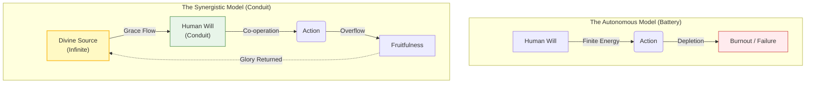

## Definition
The theological concept that human agency and Divine Grace are not competing forces (where more of one necessitates less of the other), but cooperative ones. It posits that human action is most free and effective not when it is autonomous, but when it is fully "plugged in" to the Divine source, allowing God to act *through* the human will.

**Divine Synergy** (from the Greek *syn* "together" + *ergon* "work") serves as a metaphysical antidote to burnout. In a secular, autonomous worldview, human energy is viewed as a **Battery**: it drains with exertion, requiring cessation of work to recharge. In the Synergistic worldview, human energy is a **Conduit**: the individual is the wire, and the Divine is the current.

* **The Physics of Grace:** This model suggests that human limitations (fatigue, finitude) do not disqualify one from the work but are often necessary structural components. A wire does not need to generate electricity; it only needs to be *connected* and *conductive* (obedient).
* **The Paradox of Agency:** St. Paul articulates this dynamic in 1 Corinthians 15:10: "I labored more abundantly than they all... yet not I, but the grace of God which was with me." This establishes the formula: Maximum Human Effort + Maximum Divine Reliance.
* **The Psychological Shift:** Embracing synergy removes performance pressure. The individual realizes they are not the Source, but the Instrument. If the Instrument is blunt or tired, the Master Craftsman can still effect great work, provided the Instrument remains in His hand.

## Signs / markers

- **Restful Activity:** Working diligently without underlying anxiety. "Running and not growing weary" (Isaiah 40).
    
- **Detachment from Outcomes:** Since the individual is the Instrument, the results are the Master's concern, not theirs.
    
- **Surprise:** The person is often surprised by their own courage or insight, recognizing it didn't come _from_ them, but _through_ them.
    

## Examples

- **"Flow State" (Secular Synergy):** A secular glimpse of Synergy where an athlete or musician feels like the music is "playing them." The ego steps aside, and the action becomes pure.
    
- **Recovery (12 Steps):** The admission that "I am powerless" is the prerequisite for the "Higher Power" to act. Sobriety cannot be maintained on willpower (battery); it requires Synergy (grid).
    
- **The "Muse":** In artistic creation, the sensation that an idea was "received" rather than invented.

## Contrasts

- **Opposite:** **[[Pelagianism]]:** The theological heresy asserting that humans can save themselves or achieve perfection through their own autonomous effort (The Bootstrap).
    
- **Opposite:** **Quietism:** The error of passivity—sitting back and doing _nothing_, expecting God to do it all. Synergy requires active co-operation ("work out your salvation").
    
- **Related-but-not-the-same:** **Pantheism:** Believing the human _is_ God. Synergy maintains the distinction: You are the wire; God is the electricity.

## Diagram

_(Note: The diagram contrasts the depletion of the self-reliant "Battery" model with the sustainable flow of the "Conduit" model)._

## Archetypal Figures & Case Studies

> [!abstract] St. Paul (The Apostle)
> 
> **The Trait: The Power in Weakness.**
> 
> **The Analysis:** Paul pleads to have his "thorn in the flesh" (limitation) removed. God refuses, stating, "My strength is made perfect in weakness." Paul realizes that his limitation is a port for Divine Energy. If he were naturally strong, he would run on his own battery. Because he is weak, he runs on the Grid.
> 
> **Lesson:** Limitation is the docking station for Omnipotence.

> [!abstract] The Boy with the Loaves (Feeding of the 5,000)
> 
> **The Trait: The Finite Input.**
> 
> **The Analysis:** The boy provides a mathematically insufficient amount of resources (5 loaves, 2 fish). In a "[[Closed System]]", this feeds one person. In Synergy with Christ, it feeds 5,000. The boy did not need to be rich; he just needed to be available.
> 
> **Lesson:** Output is not limited by input, but by the Multiplier.

> [!abstract] Joan of Arc
> 
> **The Trait: The Improbable Vessel.**
> 
> **The Analysis:** A teenage peasant girl leading armies. Biologically and sociologically, she possessed zero authority (limitations). Theologically, she possessed total authority (Synergy). She acted with "[[Indefatigable Agency]]" because she understood she was executing a Will larger than her own.
> 
> **Lesson:** Competence is often a barrier to Synergy; desperation is a bridge.

## The Narrative Arc (The Connection)

1. **The Depletion (The Battery Dies):** The subject reaches the end of their natural strength. They are tired, confused, or overwhelmed. They encounter the "Wall of Self."
    
2. **The Surrender (The Plug-in):** Instead of quitting (Acedia) or forcing the issue (Burnout), they admit bankruptcy ("I cannot do this"). This admission is not defeat; it is the **Initialization Sequence for Grace** (see **[[Kenosis]]**).
    
3. **The Influx (The Current):** They act _as if_ they had strength, trusting the Source to provide it in the moment of action (e.g., the exhausted mother who rises to tend the child anyway).
    
4. **The Overflow (The Fruit):** The result exceeds the capacity of the human actor. The work possesses a "resonant" quality that pure human talent cannot manufacture.

## Related terms

- **[[Kenosis]]** — The self-emptying that creates room for Synergy.
    
- **[[Instrumentality]]** — The mindset of viewing oneself as a tool in the hand of another.
    
- **[[Actual Grace]]** — The specific, transient burst of divine help given for a specific action.
    
- **[[The "Seventh Mansion"]]** — (St. Teresa of Avila) The state where Divine Synergy becomes the permanent condition of the soul.
    

## Biblical lens (NKJV)

**Scripture:**

- _"I have been crucified with Christ; it is no longer I who live, but Christ lives in me..."_ — **Galatians 2:20**
    
- _"For it is God who works in you both to will and to do for His good pleasure."_ — **Philippians 2:13**
    
- _"I am the vine, you are the branches. He who abides in Me, and I in him, bears much fruit; for without Me you can do nothing."_ — **John 15:5**
    

Discernment:

This lens serves as a diagnostic for Ego-Depletion. If one is exhausted, the question becomes: What represents the power source? Is one running on "Self" (finite) or "Spirit" (infinite)? Burnout is often identified as a symptom of Functional Atheism; acting as if God does not exist or will not assist.

## Sources / lineage

- **Patristic Source:** _[Selected Writings (St. Maximus the Confessor)](https://ia902307.us.archive.org/13/items/Elijah_Elisha/On%20the%20Cosmic%20Mystery%20of%20Jesus%20Christ_%20St.%20Maximus%20the%20Confessor.pdf)_ — *The primary theologian of "Synergy" (two wills, human and divine, working in harmony).*
    
- **Spiritual Classic:** _[Abandonment to Divine Providence (Jean-Pierre de Caussade)](https://www.ccel.org/d/decaussade/abandonment/cache/abandonment.pdf)_ — *Teaches how to locate this source in the minutiae of daily life.*
    
- **Modern Application:** _[The Practice of the Presence of God (Brother Lawrence)](https://www.basilica.ca/documents/2016/10/Brother%20Lawrence-The%20Practice%20of%20the%20Presence%20of%20God.pdf)_ — *A practical guide on how to perform menial tasks in a state of Divine Synergy.*