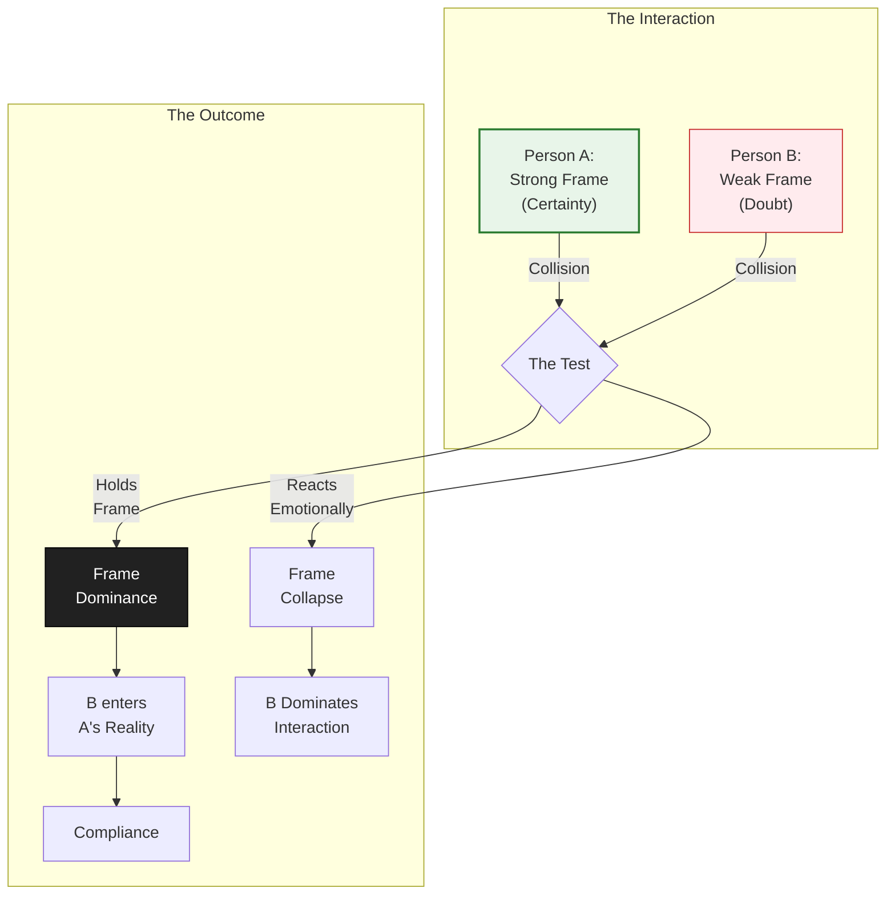

## Definition
The ability to define the meaning, context, and underlying rules of a social interaction. In any encounter between two or more individuals, the person with the stronger, more stable conviction of reality absorbs the other participants into their "frame." It is the psychological phenomenon where one person's perspective becomes the dominant operating system for the group.

The concept posits that social interactions are not neutral exchanges of information but collisions of worldviews. **Frame Control** is generally not achieved through aggression or loudness, but through **non-reactivity** and unshakeable internal certainty.

* **The Mechanism:** A "Frame" is the mental window through which one views the world. When frames collide, the weaker frame (characterized by doubt, seeking validation, or reactivity) fractures and merges into the stronger frame (characterized by certainty, indifference, and authority).
* **The Dynamic:** If an individual is seeking validation, explaining themselves excessively, or reacting emotionally, they are operating within the other person's frame. If they are assessing fit, offering value, or remaining amused by chaos, they are holding their own frame.
* **The Function:** In negotiation and leadership, Frame Control shifts the power dynamic from "chasing" (asking for resources) to "prized" (controlling the resources).

## Diagram

_(Note: The diagram illustrates the "Frame Collision," where non-reactivity leads to frame dominance)._

## Archetypal Figures & Case Studies

> [!abstract] Steve Jobs **The Trait:** _The Reality Distortion Field._
> **The Analysis:** Jobs was famous for his ability to convince engineers that impossible deadlines or technical feats were achievable. His internal conviction was so potent that it overrode the logic and doubts of those around him. He did not accept the "objective" reality; he imposed his subjective reality until it became objective. **Lesson:** Reality is malleable to the person with the strongest conviction.

> [!abstract] Jesus before Pilate (John 19) **The Trait:** _The Kingdom Frame._
> **The Analysis:** Pilate attempts to impose a **Political Frame** ("I have power to kill you"). Jesus ignores the threat and establishes a **Metaphysical Frame** ("You have no power unless it was given from above"). Jesus does not plead, argue, or react. By refusing to accept Pilate's premise, Jesus maintains authority even while in chains. **Lesson:** Power is not about physical position; it is about ontological stability.

> [!abstract] The High-Stakes Negotiator **The Trait:** _The Prize Frame._ 
> **The Analysis:** When a client says, "Why should we hire you?", the novice (Weak Frame) starts listing qualifications. The expert (Strong Frame) flips the script: "Before we get to that, I need to know if your project is a fit for our firm." The expert refuses to be the applicant and becomes the selector. **Lesson:** The person who qualifies the other holds the frame.

## The Narrative Arc (The Wrestling Match)

1. **The Collision (The Meeting):** Two people meet. Immediate subconscious signals are exchanged regarding status, neediness, and certainty.
    
2. **The Test (The Check):** The other party (consciously or subconsciously) tests the frame. They might arrive late, make a sarcastic comment, or feign disinterest. This is a "compliance check" to see if the subject will react.
    
3. **The Anchor (The Hold):** The subject refuses to react emotionally. They do not apologize excessively, they do not get angry, and they do not chase. They treat the test as irrelevant or amusing. This creates a "vacuum" of reaction that unsettles the other party.
    
4. **The Absorption (The Shift):** Realizing the subject is immovable, the other party's frame cracks. They begin to seek the subject's validation or approval. The reality has been defined by the subject.
    

## Signs / markers

- **Non-Reactivity:** The defining marker. When tested, insulted, or praised, the emotional baseline remains steady. The individual is anchored in their own estimation of value, not the external environment's.
    
- **The "Prize" Mindset:** A subconscious, non-arrogant belief that one's time and attention are the scarce assets in the interaction. This manifests as a willingness to walk away.
    
- **Amused Mastery:** Reacting to chaos, pressure, or social tests with a slight smile or detached humor, rather than anxiety or defensiveness.
    

## Examples

- **Consulting / Sales:** The difference between a "Vendor" and an "Expert." A Vendor complies with every request ("Yes, I can do that!"). An Expert diagnoses the problem and prescribes the solution ("Here is what you need; take it or leave it.").
    
- **Dating Dynamics:** When one partner pulls back attention, the partner with a weak frame panics and "double-texts" to re-establish connection. The partner with a strong frame continues their life, knowing their value is intrinsic and not dependent on the other's response.
    
- **Medical Diagnosis:** A doctor holds absolute frame control. They tell the patient when to sit, what to remove, and what the reality of their health is. The patient complies because the doctor's conviction and expertise create a frame of safety.
    

## Contrasts

- **Opposite:** **[[Reactiveness]]:** Living in response to everyone else's emotions. If the room is anxious, the reactive person becomes anxious.
    
- **Opposite:** **People Pleasing:** The compulsion to adopt the other person's frame to avoid conflict or gain approval.
    
- **Related-but-not-the-same:** **Narcissism:** Narcissism is a delusion of grandeur often brittle and easily shattered by criticism. Frame Control is a stability of purpose that can withstand criticism without crumbling.
    

## Related terms

- **Stoicism** — The philosophy of enduring pain or hardship without the display of feelings and without complaint; the foundational software of Frame Control.
    
- **[[The Intellectual Siren]]** — An archetype that uses intellectual Frame Control to seduce the mind.
    
- **[[Trustworthy UX]]** — In design, setting a clear frame for the user so they feel guided rather than confused.
    

## Biblical lens (NKJV)

**Scripture:**

- _"Then Pilate said to Him, 'Are You not speaking to me? Do You not know that I have power to crucify You, and power to release You?' Jesus answered, 'You could have no power at all against Me unless it had been given you from above.'"_ — **John 19:10-11**
    

**Discernment:** This interaction serves as the ultimate theological example of Frame Control. Pilate attempts to impose a political reality based on fear and hierarchy. Jesus counters with a Kingdom reality based on divine sovereignty. Because Jesus does not need Pilate's validation to know who He is, Pilate loses his psychological leverage. For the believer, Frame Control is not a psychological trick, but a spiritual grounding in the Word of God over the opinions of the world.

## Sources / lineage

- **Primary Methodology:** _[Pitch Anything (Oren Klaff)](https://ww2.jacksonms.gov/libweb/J0Wuzd/271008/pitch-anything__by-oren-klaff.pdf)_ — _The seminal text on "Frame Control" in a business context, defining types like the Power Frame, Time Frame, and Analyst Frame._
    
- **Theological Case Study:** The Gospels (John 18-19) — _Christ’s interactions with authority figures display perfect non-reactivity and truth-anchoring._