## Definition
A design philosophy and practice that explicitly acknowledges the user as a *soul* bearing the *Imago Dei* (Image of God), rather than merely a "user," "consumer," or "data point." It is the discipline of building technology interfaces that encourage stewardship, rest, and human connection, while actively resisting patterns that cultivate addiction, isolation, or the exploitation of human weakness.

Standard Human-Computer Interaction (HCI) typically optimizes for metrics of speed, retention, and engagement. It asks, "How do we make this task faster?" or "How do we keep the user looking?"

# Signs / markers

- **Sabbath Mode:** Applications or operating systems that include native settings to disable non-essential features during set times of rest (e.g., Sundays or evenings).
    
- **Relational Nudges:** Interfaces that prioritize high-bandwidth connection over low-bandwidth signals. For example, a prompt that suggests "Call Mom" rather than "Text Mom" when engaging with a favorite contact.
    
- **The "Enough" Signal:** The implementation of "finite scrolling" or pagination. Instead of an infinite feed, the interface stops and explicitly signals, "You are all caught up," breaking the dopamine loop.

## Examples

- **"Dumb" Phones (Light Phone / Wisephone):** Hardware designed specifically to remove the browser and social media, leaving only "Holy" tools (phone, maps, calendar) that support life without hijacking attention.
    
- **Start-up Disclaimers:** An app that asks, "Is this a good time?" before allowing you to open it, or a game that warns you after 30 minutes of play.
    
- **Chronological Feeds:** Social media timelines that display posts in time-order rather than algorithmic order, returning agency to the user to decide what they see, rather than the machine deciding.

**Holy HCI** shifts the teleology (ultimate purpose) of the interface. It asks, "How does this screen affect the user's ability to love their neighbor?" or "Does this workflow honor the user's biological and spiritual limits?"
* **The Anthropological Shift:** It rejects the reductionist view of the human as a "brain in a vat" driven by dopamine. It treats the human as an embodied, spiritual creature who needs rest (Sabbath) and face-to-face connection.
* **Friction for Good:** While standard UX seeks "frictionless" experiences to maximize consumption, Holy HCI intentionally introduces "redemptive friction"—slowing users down when they are angry, creating stopping points to prevent mindless scrolling, or encouraging disconnection.
* **The Liturgical Function:** It recognizes that apps act as modern liturgies—repeated habits that shape our loves. Holy HCI seeks to design "liturgies" that form virtues (patience, kindness) rather than vices (wrath, sloth).

## Diagram

```mermaid
graph TD
    subgraph "Standard HCI (Exploitative)"
        %% Invisible Spacer for margin
        Spacer1[ ]:::empty

        A["User Identity:<br/>'Data Point'"] -->|Goal: Engagement| B["Mechanism:<br/>Exploit Weakness<br/>(Dopamine)"]
        B -->|Result| C["Outcome:<br/>Addiction /<br/>Isolation"]
        
        %% Link spacer invisibly
        Spacer1 ~~~ A
    end

    subgraph "Holy HCI (Redemptive)"
        %% Invisible Spacer for margin
        Spacer2[ ]:::empty

        D["User Identity:<br/>'Imago Dei'"] -->|Goal: Stewardship| E["Mechanism:<br/>Respect Limits<br/>(Rest/Friction)"]
        E -->|Result| F["Outcome:<br/>Flourishing /<br/>Connection"]
        
        %% Link spacer invisibly
        Spacer2 ~~~ D
    end

    style A fill:#ffebee,stroke:#c62828
    style C fill:#ffebee,stroke:#c62828
    style D fill:#e8f5e9,stroke:#2e7d32,stroke-width:2px
    style F fill:#e8f5e9,stroke:#2e7d32
    
    %% Define the style for invisible spacers
    classDef empty width:0px,height:20px,fill:none,stroke:none,color:none;
```

_(Note: The diagram contrasts the trajectory of design when the user is viewed as a resource versus a soul)._

## Sources / lineage

- **Cultural Theology:** _[The Tech-Wise Family (Andy Crouch)](https://static1.squarespace.com/static/5ece64d146406a6fb2b8e143/t/62265a958d8faf0294ef1862/1646680731747/TechWise+Selected+Pages.pdf)_ — _Foundational concepts on how technology shapes the "household" and the need for spatial/temporal limits._
    
- **Philosophical Ethics:** _[You Are Not a Gadget (Jaron Lanier)](https://mogami.neocities.org/files/gadget.pdf)_ — _Arguments against the "lock-in" of designs that degrade human dignity._
    
- **Design Theory:** _[Calm Technology (Amber Case)](https://www.calmtech.com/thesis/16256040-Cell-Phones-and-their-Technosocial-Sites-of-Engagement-Amber-Case-Thesis.pdf)_ — _Principles for designing tech that respects human attention._

## Archetypal Figures & Case Studies

> [!abstract] The Slot Machine (The Anti-Pattern) **The Trait:** _Variable Rewards._ 
> **The Analysis:** The slot machine is the perfect example of "Unholy HCI." It is designed to induce a trance state (the "Machine Zone") by exploiting the brain's uncertainty about rewards. It isolates the user from their environment and drains their resources. Many social media feeds mimic this mechanics (pull-to-refresh). **Lesson:** Engagement at the cost of volition is exploitation.

> [!abstract] The Tool Bench (The Ideal) **The Trait:** _Volitional Engagement._ 
> **The Analysis:** A hammer sits on a bench. It does not beep at you. It does not vibrate to say, "You haven't hammered in a while." It is entirely passive until the user _wills_ to use it. When the task is done, it remains silent. **Lesson:** Technology should be a servant, not a nagging master.

> [!abstract] The Sabbath Switch **The Trait:** _Cyclical Time._
> **The Analysis:** Interfaces that acknowledge time is not a flat line but a cycle of work and rest. "Sabbath Modes" or "Downtime" settings that gray out apps or block notifications are attempts to encode Holy HCI into the OS, protecting the user from the device itself.

## The Narrative Arc (The User Journey)

1. **The Entry (The Intent):** The user engages the technology with a specific purpose (e.g., "I need to message my spouse").
    
2. **The Interaction (The Guardrails):** The interface facilitates the task without offering "side quests" (ads, related videos, clickbait) that distract from the intent.
    
3. **The Completion (The Stop):** The task is finished. The interface provides a clear "Done" state. It does not autoplay the next item. It creates a natural exit point.
    
4. **The Release (The Restoration):** The user puts the device away and returns to the physical world, their attention span intact rather than fragmented.

## Related terms

- **[[Teleological Interface]]** — Interfaces designed with a specific "end" (telos) of human flourishing in mind.
    
- **[[Trustworthy UX]]** — Design that prioritizes user agency and truthfulness.
    
- **[[Spiritual Formation]]** — The process of shaping the human spirit; recognizing that screens play a role in this formation.

## Contrasts

- **Opposite:** **[[Dark Patterns]]:** UX design choices that trick users into doing things they didn't mean to, such as buying insurance or signing up for recurring bills.
    
- **Opposite:** **[[Persuasive Technology]]:** Design focused on changing user attitudes or behaviors through influence, often without their explicit consent.
    
- **Related-but-not-the-same:** **[[Digital Minimalism]]:** A user lifestyle choice; Holy HCI is the _designer's_ choice to build products that support that lifestyle.

## Biblical lens (NKJV)

**Scripture:**

- _"For you, brethren, have been called to liberty; only do not use liberty as an opportunity for the flesh, but through love serve one another."_ — **Galatians 5:13**

**Discernment:** Technology provides "liberty" (freedom of options, access, and speed). **Holy HCI** ensures that this liberty is architected to _serve_ the neighbor, rather than to feed the _flesh_ (the biological drives for dopamine, outrage, and lust). It posits that a design which maximizes "freedom of choice" but destroys the "freedom of will" (via addiction) is unholy.